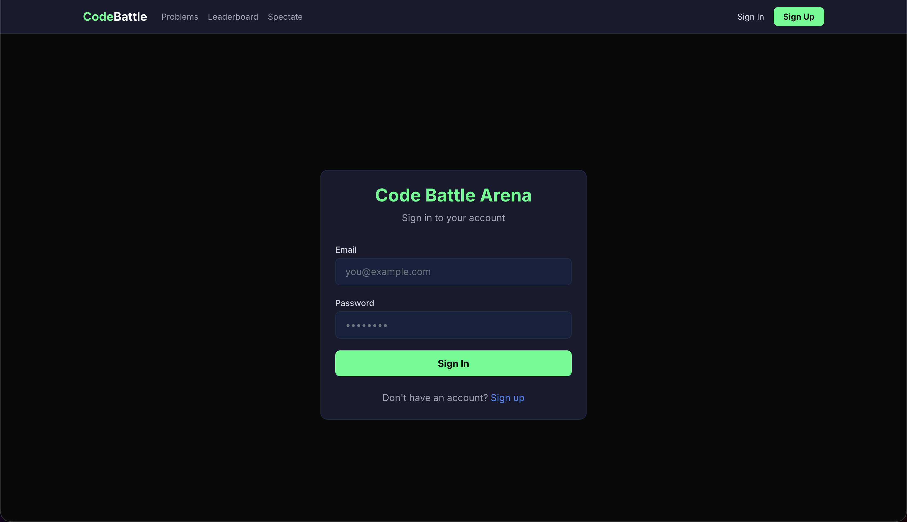
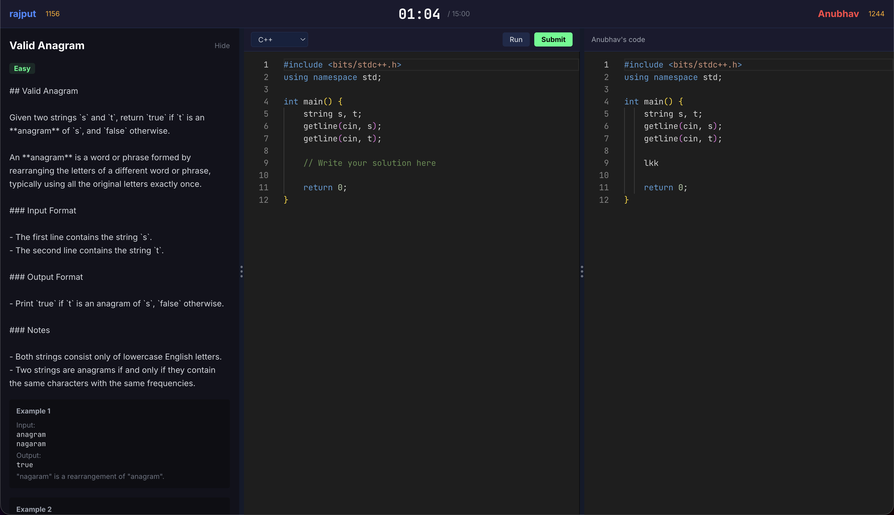
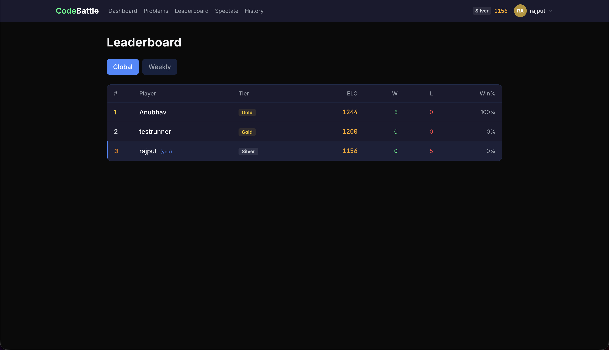

# Code Battle Arena

Real-time 1v1 competitive coding platform. Two players get matched by ELO, solve the same problem, and race to finish first — with live spectating and replays.

Built with MERN + TypeScript, Socket.IO for real-time sync, Redis for matchmaking/leaderboards, and Piston API for sandboxed code execution.





## What it does

- **1v1 code battles** — matchmaking pairs players within ±200 ELO (expands over time if no match is found)
- **Monaco Editor** with syntax highlighting for C++, Python, JavaScript, Java
- **Sandboxed execution** via Piston — each test case returns AC, WA, TLE, RTE, or CE
- **ELO system** (K=32) with tiers from Bronze (0-1199) to Master (2000+)
- **Spectator mode** — watch live matches with real-time code updates
- **Match replays** — full timeline scrubber with play/pause and speed controls
- **Anti-cheat** — paste detection, tab-switch monitoring, code similarity checks, 500ms opponent code delay
- **Custom rooms** — challenge friends via shareable invite links
- **Admin panel** — full problem CRUD with test case management

## Tech stack

| Layer | Tech |
|---|---|
| Frontend | React 18, TypeScript, Vite, Tailwind, Zustand |
| Editor | Monaco Editor (`@monaco-editor/react`) |
| Backend | Node.js, Express, TypeScript |
| Real-time | Socket.IO |
| Database | MongoDB + Mongoose |
| Cache/Queue | Redis (ioredis) |
| Code execution | Piston API (Docker-sandboxed) |
| Auth | JWT + bcryptjs |

## How it works

```
React Client  ──REST──>  Express Server  ──>  MongoDB
     ↕ Socket.IO              |
                             Redis (matchmaking queue + leaderboards)
                              |
                         Piston API (code execution)
```

- REST handles auth, problems, match history, submissions
- Socket.IO handles matchmaking, live code sync, spectator updates, match state
- Redis stores the matchmaking queue and leaderboards as sorted sets
- Piston runs user code in isolated Docker containers

## Setup

You'll need Node 18+, MongoDB, and Redis running locally.

```bash
git clone https://github.com/Anubhav1410/code-battle-arena.git
cd code-battle-arena
npm install
```

Create `server/.env`:

```env
PORT=5000
MONGODB_URI=mongodb://localhost:27017/code-battle-arena
REDIS_URL=redis://localhost:6379
JWT_SECRET=change-this-to-something-random
JWT_EXPIRES_IN=7d
PISTON_API_URL=https://emkc.org/api/v2/piston
CLIENT_URL=http://localhost:5173
NODE_ENV=development
```

Create `client/.env`:

```env
VITE_API_URL=http://localhost:5000/api
VITE_SOCKET_URL=http://localhost:5000
```

Seed the database (creates admin account, test users, and 20 problems):

```bash
npm run seed -w server
# Admin: admin / admin123
# Test accounts: player1 / test123, player2 / test123
```

Run it:

```bash
npm run dev
# Client runs on :5173, server on :5000
```

### Self-hosting Piston (optional)

The public Piston API works fine for dev. For production, spin up your own:

```bash
docker compose -f docker-compose.piston.yml up -d

# Install runtimes
curl -X POST http://localhost:2000/api/v2/packages -H 'Content-Type: application/json' -d '{"language":"cpp","version":"10.2.0"}'
curl -X POST http://localhost:2000/api/v2/packages -H 'Content-Type: application/json' -d '{"language":"python","version":"3.10.0"}'
curl -X POST http://localhost:2000/api/v2/packages -H 'Content-Type: application/json' -d '{"language":"javascript","version":"18.15.0"}'
curl -X POST http://localhost:2000/api/v2/packages -H 'Content-Type: application/json' -d '{"language":"java","version":"15.0.2"}'
```

## Challenges & what I learned

**Syncing editor state in real-time** was the trickiest part. Monaco fires `onChange` on every keystroke, so sending raw updates over Socket.IO would flood the connection. I ended up debouncing at 300ms on the sender side and adding a 500ms delay before showing opponent code — which also doubles as an anti-cheat measure since you can't just copy what your opponent is typing.

**Matchmaking with ELO expansion** took some iteration. Initially I tried a simple queue where you match the closest ELO, but that meant high-rated players would wait forever. The current system starts with a ±200 window and expands by ±50 every 10 seconds, which keeps wait times reasonable without creating unfair matches.

**Replay system** — storing every code change and event during a match makes the MongoDB documents pretty large. I went with an append-only events array embedded in the match document rather than a separate collection, which simplified queries for the replay player at the cost of larger documents. For a production app I'd probably move to a separate events collection with cursor-based pagination.

**Redis sorted sets** turned out to be perfect for both the matchmaking queue (sorted by ELO for range queries) and leaderboards (sorted by rating for rank queries). Weekly leaderboard resets are handled by a simple key rotation.

## Deployment

For production I used:
- **MongoDB Atlas** (free tier) for the database
- **Upstash** (free tier) for Redis
- **Railway** for the backend
- **Vercel** for the frontend
- **$5 VPS** (DigitalOcean/Hetzner) for self-hosted Piston

Set `CLIENT_URL` on Railway to your Vercel URL, and `VITE_API_URL` / `VITE_SOCKET_URL` on Vercel to your Railway URL. Run the seed script against your Atlas URI and you're good.

## Known issues / TODO

- [ ] Battle arena isn't mobile-responsive (shows a "desktop required" notice on small screens)
- [ ] The public Piston API has rate limits — production needs a self-hosted instance
- [ ] No WebSocket reconnection handling during a match if connection drops mid-battle (there's a 60s grace period but no auto-reconnect)
- [ ] Code similarity analysis is basic (token-level) — could be improved with AST-based comparison
- [ ] No pagination on match history yet, loads everything at once

## Project structure

```
code-battle-arena/
├── client/          # React frontend (Vite)
│   └── src/
│       ├── components/   # UI components (editor, battle, replay, etc.)
│       ├── pages/        # Route-level pages
│       ├── store/        # Zustand stores
│       ├── services/     # API client + Socket.IO
│       └── hooks/        # useAuth, useBattle, useSocket, useTimer
├── server/          # Express backend
│   └── src/
│       ├── models/       # Mongoose schemas
│       ├── routes/       # REST endpoints
│       ├── controllers/  # Request handlers
│       ├── services/     # Business logic (matchmaking, ELO, executor)
│       ├── socket/       # Socket.IO event handlers
│       └── middleware/   # Auth, rate limiting, error handling
└── shared/          # Shared TypeScript types
```
